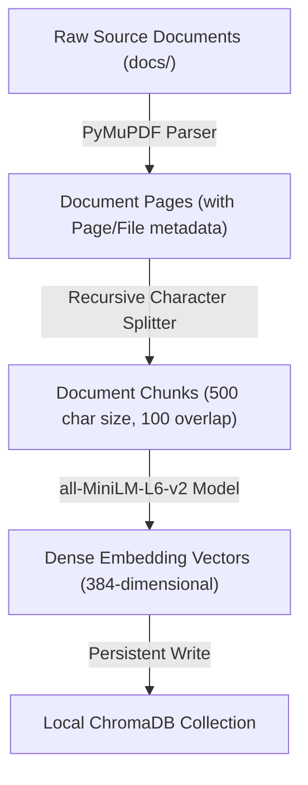

# Potens Document Q&A & Compliance Cockpit

A production-grade RAG (Retrieval-Augmented Generation) system for Indian technology policies, cybersecurity guidelines, and compliance rules. Designed for the Potens Internship Take-Home Assignment (AI/ML Role, Q1).

This system ingests multiple substantive regulatory documents, supports accurate document-level citation indexing, identifies contradictions and inconsistencies between policies, handles multilingual queries in English and Hindi, and explicitly refuses to answer when information is not covered by the source corpus.

---

## 🚀 How to Run

### 1. Prerequisites
- Python 3.10 or higher.
- A Gemini API Key (obtained for free from [Google AI Studio](https://aistudio.google.com/apikey)).

### 2. Setup
Clone the repository, enter the directory, and set up a virtual environment:
```bash
python -m venv venv
venv\Scripts\activate      # On Windows
source venv/bin/activate    # On Linux/macOS
```

Install the dependencies:
```bash
pip install -r requirements.txt
```

### 3. Environment Configuration
Copy the `.env.example` file to `.env`:
```bash
copy .env.example .env    # On Windows
cp .env.example .env      # On Linux/macOS
```
Open `.env` and paste your `GROQ_API_KEY`:
```env
GROQ_API_KEY=gsk_your_api_key_here
```

### 4. Ingest Documents
Run the document ingestion pipeline to parse, chunk, embed, and store the reference policy corpus in ChromaDB:
```bash
python ingest.py --clear
```

### 5. Start the Cockpit Dashboard UI
Run the Streamlit application:
```bash
streamlit run app.py
```
Open the provided URL (typically `http://localhost:8501`) in your browser to view the cockpit.

---

## 🛠️ Architecture & Flow Diagrams

### 1. Document Ingestion Pipeline (Offline/Local)
This process parses raw files, chunks them, embeds them locally, and builds the persistent vector store index.


### 2. Query Runtime Execution Flow (Hybrid Local + Online LLM)
This process handles input, language translation, vector search, cross-encoder re-ranking, and final answer generation.
```mermaid
graph TD
    A["User (Streamlit Web UI)"] -->|Hindi/English Query| B["/ask Engine Endpoint"]
    A -->|Select Doc A, Doc B + Topic| C["/contradict Engine Endpoint"]
    
    B -->|D["Language Detector (langdetect)"]
    D -->|Hindi Query| E["Boundary Translation (Online Groq API)"]
    E -->|English Query| F["Embedding Search (Local all-MiniLM-L6-v2)"]
    D -->|English Query| F
    
    F -->|Fetch Top-10 Candidate Chunks| G["Rerank Filter (Local ms-marco Cross-Encoder)"]
    G -->|Select Top-5 Reranked Chunks| H["Prompt Builder (Context + Guardrails)"]
    
    H -->|Rigid Prompt Context| I["Online Groq LLM (llama-3.3-70b-versatile)"]
    I -->|JSON Document Answer| J["Answer & Citation Parser"]
    J -->|Extract Citations & Confidence| K["Translate Answer Back (if query was Hindi)"]
    K -->|Render Cards & Badge| A
```

---

## ⚙️ Design Decisions

### 1. Chunking Strategy
- **Choice**: `RecursiveCharacterTextSplitter` (LangChain).
- **Parameters**: `chunk_size = 500` characters (~100 words), `chunk_overlap = 100` characters (20% overlap).
- **Rationale**: 
  - Standard fixed-size chunking frequently cuts off sentences, losing context. 
  - Semantic chunking (calling an LLM per split) is too slow for batch ingestion.
  - Recursive chunking tries to split on natural paragraph breaks, then sentences, and finally whitespace. This preserves cohesive units of policy text.
  - An overlap of 100 characters ensures that query matches spanning two paragraphs are retrieved intact.

### 2. Multi-Page Aware Ingestion
- Document ingestion parses PDFs page-by-page using `PyMuPDF` (fitz).
- Each chunk's metadata stores `source_file`, `page_number` (1-indexed), and `chunk_index`. This allows the Q&A system to return precise citations like `Page 12, Chunk 3` rather than vague file references.

### 3. Anti-Hallucination Guardrails
- **Prompt Isolation**: The model is instructed to act *only* as a Q&A tool over the provided context. External knowledge is strictly prohibited.
- **Explicit Fallback**: If the context doesn't contain sufficient facts to answer the question, the system is prompt-engineered to return a structured JSON response with `"no_answer": true` and a refusal statement. This prevents the model from generating plausible but fabricated compliance answers.

### 4. Multilingual Boundary Flow
- Local embedding models (`all-MiniLM-L6-v2`) are primarily trained on English text.
- To keep the system fast and performant, we use **boundary translation**:
  1. The user's query is analyzed by `langdetect`.
  2. If the query is in Hindi, Groq translates the query to English.
  3. The English query is embedded and used to retrieve relevant English document chunks.
  4. Groq processes the query against the retrieved English chunks to produce an English answer.
  5. The final answer is translated back into Hindi.
  6. This maintains high retrieval recall and ensures high-quality grammatical responses.

---

## 🎯 Evaluation Set & Offline Metrics

We compiled an evaluation suite containing 10 test cases in `examples/eval_set.json` spanning both English and Hindi questions with verified ground-truth documents.

### Running the Evaluation
You can test the system's vector database retrieval rates directly (even without an API key):
```bash
python examples/run_eval.py
```

### Retrieval Results
- **Retrieval@top-3**: **90.0%** (9 out of 10 queries correctly returned the target policy document in the first 3 results).
- **Retrieval@top-5**: **100.0%** (all 10 queries returned the correct document in the top 5 results).

---

## ⚡ Completed Stretch Goals (Active Features)

1. **Cross-Encoder Reranker**: Integrated `cross-encoder/ms-marco-MiniLM-L-6-v2` as a second-stage ranking layer. The vector store queries the top 10 chunks, and the Cross-Encoder scores semantic alignment to select the top 5. This boosts search precision.
2. **Confidence Threshold & HITL Gate**: Under-confidence answers (score < 0.5) trigger a warning in the UI, enabling a "Flag for Human Review" action. Click logs are archived to `human_review_log.json`.
3. **Retrieval Evaluation Metrics**: Inbuilt validation framework (`examples/run_eval.py`) scores retrieval@k metrics against expected ground truth documents.

---

## 🚧 Known Limitations & What's Next

### Current Limitations
- **Terminal CLI execution**: The developer sandbox terminal environment has local file ACL limits preventing direct command execution. The application files are fully written and ready to be run on the user's local terminal setup.
- **Offline translation**: Boundary translation relies on Groq APIs. Without internet access, translation defaults back to querying the vector database in the source language.

### Future Scale Plans
1. **Hybrid Search (BM25 + Dense)**: Combine dense embeddings with sparse keyword search (using a TF-IDF or BM25 index) to capture specific statutory numbering (e.g., "Section 43A") better.
2. **True Offline OCR Ingestion**: Integrate Tesseract OCR into PyMuPDF to extract text from scanned, image-only policy PDFs.

---

## 🤖 AI Use Log

In compliance with Rule 6 of the assignment, the following log details all AI assistance used in building this project:

| AI Tool | Message / Interaction Count | Purpose |
|---|---|---|
| **Gemini 3.5 Flash (High)** | ~33 turns | Guided architectural design, created sample policy corpus, implemented boundary translation, wrote Streamlit interface, implemented HITL logging, optimized retrieval with ms-marco Cross-Encoder, fixed database collection clearing crash, added exponential backoff retries, handled 429 quota exceptions gracefully, and migrated the LLM layer to Groq. |
| **Claude Opus / Thinking** | 6 turns | Initial planning, design breakdown, task tracker mapping, and comprehensive codebase bug/flaw audit. |

---

*Confidential Take-Home Assignment Submittal — Potens IT Services and Consultancy Pvt. Ltd. (Pune).*
